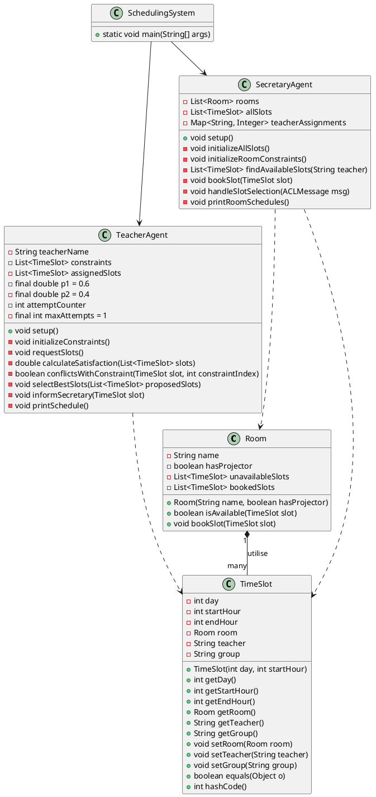
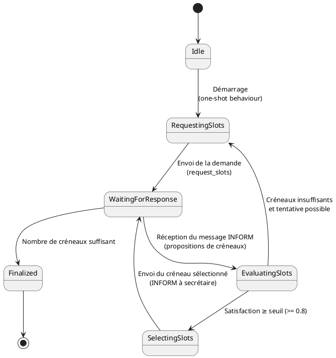
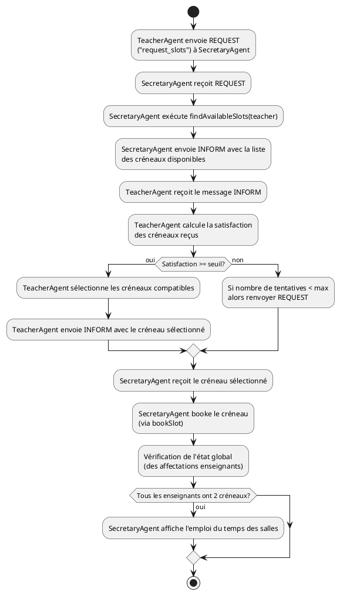
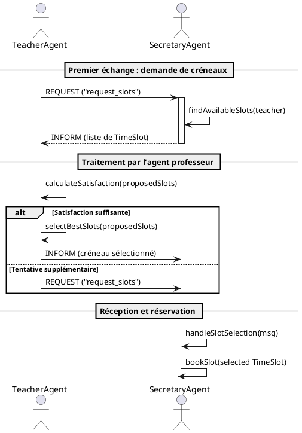
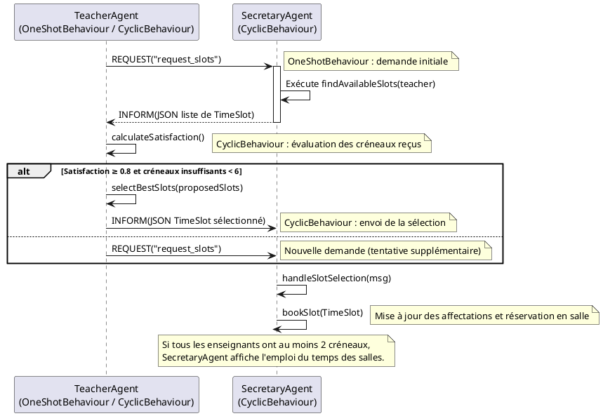

# TP JADE - Gestion d'un Emploi Du Temps - Liam BOUDADI

## Fonctionnement de l’application

L’application gère la planification (EDT) via des agents JADE :
### Agents Professeurs (TeacherAgent)
Chaque enseignant (e1, e2, e3) doit proposer deux cours de deux heures sur deux jours.
-  Contraintes horaires : 
Chaque enseignant a deux créneaux à éviter (avec un ordre d’importance, p1 > p2)
-  Comportement :
  1. Au démarrage, le TeacherAgent initialise ses contraintes et envoie une première demande (via un OneShotBehaviour) à l’agent secrétaire pour obtenir la liste des créneaux disponibles.
  2. Dans son CyclicBehaviour, il reçoit les propositions (message INFORM) et calcule un score de satisfaction.
  3. Si la satisfaction est suffisante (≥ 0,8) et que le nombre de créneaux assignés n’est pas encore atteint, il sélectionne les créneaux les mieux adaptés (en filtrant ceux ne conflit pas avec ses contraintes) et les notifie à l’agent secrétaire.
  4. En cas de résultat insuffisant et tant que le nombre maximal de tentatives n’est pas atteint, il renvoie une nouvelle demande.
### Agent Secrétaire (SecretaryAgent)
L’agent secrétaire gère l’ensemble des salles et des créneaux horaires.
- Salles et créneaux :
Les salles (s1, s2, s3) possèdent des contraintes (créneaux indisponibles) et deux d’entre elles possèdent un rétroprojecteur.
Les créneaux possibles sont générés (par exemple : jours 1 et 2, heures 8, 10, 14, 16).
- Comportement :
  1. Il attend les demandes (REQUEST) et les notifications de sélection de créneaux (INFORM).
  2. Lorsqu’une demande est reçue, il parcourt l’ensemble des créneaux et, pour chaque salle disponible pour le créneau (vérification via la méthode isAvailable()), il crée une instance de TimeSlot associée à la salle et au professeur demandeur.
  3. Il renvoie ensuite la liste des créneaux disponibles au professeur.
  4. Lorsqu’un créneau sélectionné est reçu, il le « booke » dans la salle concernée et met à jour un compteur d’affectations par professeur.
  5. Quand tous les professeurs ont au moins deux créneaux assignés, l’agent affiche l’emploi du temps des salles.

## Points de vue multi-agent
### Mécanisme de résolution :
Le système repose sur une négociation par requêtes et réponses (vote/filtrage) dans lequel chaque enseignant évalue les propositions du secrétaire et renvoie sa sélection. Le protocole est simple et itératif (possibilité de renvoyer une nouvelle demande si la satisfaction n’est pas suffisante).

### Rôles et comportements :

- TeacherAgent utilise :
    - OneShotBehaviour pour initier la demande.
    - CyclicBehaviour pour écouter les réponses et traiter les créneaux proposés.
- SecretaryAgent utilise un CyclicBehaviour pour écouter en permanence les messages de type REQUEST et INFORM, pour proposer des créneaux (en tenant compte des contraintes des salles) et réserver les créneaux choisis. 
### Composition de l'environnement :
L’environnement comprend trois agents professeurs et un agent secrétaire, avec un ensemble de salles et de créneaux horaires qui représentent l’espace des possibilités pour la planification.

## Diagrammes

### Diagramme de classes

### Diagramme d'états (pour TeacherAgent)

### Diagramme d'acitivité (flux de planification)

### Diagramme de séquence

### Diagramme de dialogue JADE entre les agents

